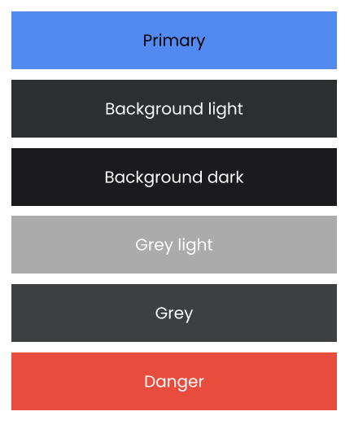
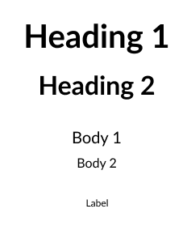
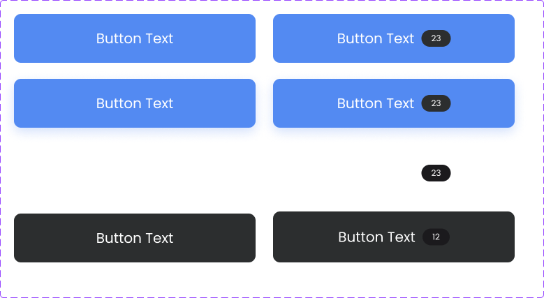

<div align="center">
  
  
  <br>

  <h1>Figma to Flutter MCP Server</h1>
  <h3>Utilize Figma's rich data in your coding agent.<br/>Implement designs in Flutter way!</h3>
  <a href="https://npmcharts.com/compare/figma-flutter-mcp?interval=30">
    
  </a>
  <a href="https://github.com/mhmzdev/figma-flutter-mcp/blob/main/LICENSE">
    
  </a>
  <a href="https://twitter.com/mhmzdev">
    
  </a>
</div>
<br>

Use [Cursor](https://cursor.sh) or other AI-powered tools to access Figma's rich files, data, components and much more using [MCP server](https://modelcontextprotocol.io/).

## 🎥 [Video Demo](https://youtu.be/o_GezwAlXlU)
Showcased almost all the features of Figma Flutter MCP with real figma design.

## 📝 [Getting Started](docs/getting-started.md)
You may explore the detailed [getting started](docs/getting-started.md) docs or the [demo video](https://youtu.be/o_GezwAlXlU) as quick-start. As its a First Release hence there's a lot of room for improvements so you can checkout the [issues](https://github.com/mhmzdev/figma-flutter-mcp/issues) to see what else there's to work or to improve.

## 📚 How it works
1. [Components/Widgets](src/extractors/components/)
- ✅ Extract Figma node data: Layout, styling, dimensions, colors, text content, etc.
- ✅ Analyze structure: Child elements, nested components, visual importance
- ✅ Provide guidance: Suggest Flutter widgets and implementation patterns
- ❌ NOT generating actual Flutter code files

2. [Screens](src/extractors/screens/)
- ✅ Extract screen metadata: Device type, orientation, dimensions
- ✅ Identify sections: Header, footer, navigation, content areas
- ✅ Analyze navigation: Tab bars, app bars, drawers, navigation elements
- ✅ Provide Scaffold guidance: Suggest Flutter screen structure
- ❌ NOT generating actual Flutter screen

Since its just helping AI write Flutter code so it means the better your prompt will be the better results you'll get.

## 🛠️ Usage
Following steps shows a minimal usage and setup instructions:

### 🔑 Figma API Key
You will need to create a Figma access token to use this server. Instructions on how to create a Figma API access token can be found [here](https://help.figma.com/hc/en-us/articles/8085703771159-Manage-personal-access-tokens).

### 🏹 MCP in Cursor
Once you've the FIGMA API KEY, you can setup the MCP in cursor as follows:
1. Press CMD + Shift + P (Ctrl on Windows)
2. Type "Open MCP Settings"
3. Click on "Add new MCP"
4. Paste the below json object

#### MacOS/Linux
```
{
  "mcpServers": {
    "Figma Flutter MCP": {
      "command": "npx",
      "args": ["-y", "figma-flutter-mcp", "--figma-api-key=YOUR-API-KEY", "--stdio"]
    }
  }
}
```
#### Windows
```
{
  "mcpServers": {
    "Figma Flutter MCP": {
      "command": "cmd",
      "args": ["/c", "npx", "-y", "figma-flutter-mcp", "--figma-api-key=YOUR-API-KEY", "--stdio"]
    }
  }
}
```

> NOTE: If you've installed this MCP as `npm` package make sure to keep it updated to latest version. Sometimes, it caches the old version and keep showing you error like "Not being able to use tool call" or "Figma API key setup is not working" etc.

### 🧑🏼‍💻 Local Setup
Please ensure that in local setup your version remains updated with your local server, sometimes `npm i` has installed the server globally for you and the keeps on overriding your local changes because of which you might not see any update.

#### 0. Prerequisites
- Node.js 18+
- Figma API Key (Access Token)
- Cursor AI IDE with MCP support
- Flutter SDK

#### 1. Clone the Repo
```
# Clone or download the project
git clone <your-repo-url> figma-flutter-mcp
cd figma-flutter-mcp

# Install dependencies
npm install
```
#### 2. Configure
Either use `.env` to setup various values. Checkout [.env.example](.env.example)
#### MacOS/Linux
```
{
  "mcpServers": {
    "figma-flutter-mcp": {
      "command": "node",
      "args": [
        "/Path/to/figma-flutter-mcp/dist/server.mjs",
        "--figma-api-key=YOUR_API_KEY",
        "--stdio"
      ]
    }
  }
}
```
#### Windows
```
{
  "mcpServers": {
    "figma-flutter-mcp": {
      "command": "node",
      "args": [
        "/Path/to/figma-flutter-mcp/dist/server.mjs",
        "--figma-api-key=YOUR_API_KEY",
        "--stdio"
      ]
    }
  }
}
```
> NOTE: If you want to keep it for only current project then setup the above JSON in `.cursor-mcp/config.json` BUT be mindful about the API_KEY so make sure to put this file in `.gitignore`

#### 3. Build & Run
```
# Development mode (with auto-restart)
npm run dev

# Production mode
npm run build
```
You can now verify in MCP settings that the server is running and tools are available.

## 🧱 Basic Workflow
1. **Setup Theme & Typography**: The most efficient way, put two frames in Figma with Theme colors and Typography samples on it. For instance:




- Figma Desktop: Select the frame and press CMD + L or Ctrl + L
- Figma Web: Select the frame and copy the URL

> 💡 HINT: The valid URL will contain a FILE ID and NODE ID params

```
"Setup flutter theme from <figma_link> including Colors and Typography.
```

2. **Widget Generation**: The most efficient way, use COMPONENTS in figma. For example:



This one has 8 variants, you may prompt whether you want to have variants or not.
```
"Create this widget in flutter <figma_link>, setup only 2 variants for now and break the files in smaller parts for code readability.
```
If you **do not** have COMPONENTS in figma, you can use FRAME just prompt the AI that you want this to be a widget and it will handle the rest.

3. **Full Screen Generation**: If there are any IMAGE ASSETS available, it will export them and put them in `assets/` along with `pubspec.yaml`
```
"Create full screen from this figma link <figma_link>, ensure the code is readable by having smaller files
```
4. **Assets Export**:
- Image Assets: Will work automatically when generating screens
```
"Export this image asset from figma <figma_link>
```
- SVG Assets: Will NOT work automatically, explained below.
```
"Export this as an SVG asset from Figma: <figma_link>
```
#### ⚠️ Why SVG assets don’t work with screen generation
clarify that vectors include icons and pen-tool shapes, so bulk exports may grab unintended nodes; recommend exporting SVGs separately. This process still saves you a lot of time by exporting them in your `assets/svg/` directory and updating your `pubspec.yaml`.

## 🧰 MCP Tools
Assets related:
- `export_flutter_assets`: Individual tool for image assets used with Screen generation
- `export_svg_flutter_assets`: Individual tool for SVG assets export

Widget related:
- `analyze_figma_component`: For type=COMPONENT in figma or FRAME prompted by user
- `list_component_variants`: For type=COMPONENT_SET in figma (Widget variants)
- `inspect_component_structure`: For nested COMPONENTS or FRAMES

Full screen related:
- `analyze_full_screen`: type=FRAME for full screen and assets export (image only)
- `inspect_screen_structure`: For layouts and other information for building screen

## ⚠️ Disclaimers

- **Early release**: It's the [first version](https://github.com/mhmzdev/figma-flutter-mcp?tab=readme-ov-file#-getting-started) release, so you might have some bugs or mis-behaviour please bear with me, I'm learning 🥲
- **Contribution**: Developers who wants to look into code might see some repetitions and redundancies, I'll be removing them gradually.
- **Figma API usage**: All tools in this server call the official Figma REST API using your personal access token. Actions like analyzing components/screens and exporting assets result in API requests to Figma on your behalf.
- **Rate limiting**: Heavy usage may trigger Figma rate limits (e.g., HTTP 429). The server includes retry with backoff, but it does not bypass Figma limits. If you encounter rate limits, wait a few minutes and reduce the request volume.
- **Tips to avoid limits**:
  - Analyze one component or one screen at a time instead of large batches.
  - Use figma links to frames/components/nodes; avoid scanning entire pages.
  - Space out repeated commands; avoid rapid-fire calls in quick succession.
  - For asset exports, only export required nodes; avoid `includeMultipleResolutions` unless needed and keep `scale` reasonable.
- **Security**: Keep your Figma token secret. Prefer `.env` and do not commit keys or machine-specific MCP configs to source control.
- **Compliance**: Use the Figma API in accordance with Figma’s Terms. Ensure you have access rights to the files you request.

## 🙌🏼 Acknowledgments
I came across [Figma Context MCP](https://github.com/GLips/Figma-Context-MCP) by [Graham Lipsman](https://x.com/glipsman) that sparks this motivation for me to develop Figma to Flutter explicitly having features like:
- Assets exports
- Colors and Theme setups
- Widget tree and full screen building

Others coming soon...

## 🔑 License
This project is licensed under the MIT License - see the [LICENSE](LICENSE.md) file for details

## 🙋‍♂️ Author
#### Muhammad Hamza
[](https://www.linkedin.com/in/mhmzdev)

You can also follow my GitHub Profile to stay updated about my latest projects:

[](https://github.com/mhmzdev)

If you liked the repo then kindly support it by giving it a star ⭐!

Copyright (c) 2025 MUHAMMAD HAMZA

---

**Built with ❤️ for designers and developers who want to bridge the gap between design and code.**