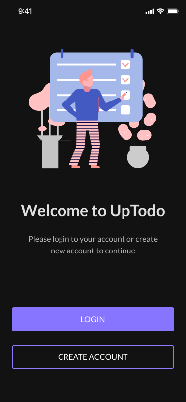

<div align="center">
  
  <br>

  <h1>Figma to Flutter MCP Server</h1>
   <p>
    🌐 Available in:
    <a href="README.ko.md">한국어 (Korean)</a> |
    <a href="README.ja.md">日本語 (Japanese)</a> |
    <a href="README.zh-cn.md">简体中文 (Simplified Chinese)</a> |
    <a href="README.zh-tw.md">繁體中文 (Traditional Chinese)</a>
  </p>
  <h3>Utilize Figma's rich data in your coding agent.<br/>Implement designs in Flutter way!</h3>
  <a href="https://npmcharts.com/compare/figma-flutter-mcp?interval=30">
    
  </a>
  <a href="https://github.com/mhmzdev/figma-flutter-mcp/blob/main/LICENSE">
    
  </a>
  <a href="https://twitter.com/mhmzdev">
    
  </a>
</div>
<br>

Use [Cursor](https://cursor.sh) or other AI-powered tools to access Figma's rich files, data, components and much more using [MCP server](https://modelcontextprotocol.io/).

## 📋 Table of Contents

- [🦋 Observable Flutter #70](#-observable-flutter-70)
- [🎥 Short Video Demo](#-short-video-demo)
- [📝 Getting Started](#-getting-started)
- [📚 How it works](#-how-it-works--details-here)
- [🛠️ Usage](#-usage)
  - [🔑 Figma API Key](#-figma-api-key)
  - [🏹 MCP in Cursor](#-mcp-in-cursor)
  - [🚀 Quick Start for Local Testing](#-quick-start-for-local-testing)
- [🧱 Basic Workflow](#-basic-workflow)
  - [🤖 AI Coding Agent Assistance](#-ai-coding-agent-assistance)
  - [⚠️ If SVG assets don’t work with screen generation](#-if-svg-assets-dont-work-with-screen-generation)
- [⚠️ Disclaimers](#-disclaimers)
- [🙌🏼 Acknowledgments](#-acknowledgments)
- [🧱 Other framworks](#-other-framworks)
- [🔑 License](#-license)
- [🙋‍♂️ Author](#-author)
  - [Muhammad Hamza](#muhammad-hamza)

## 🦋 Observable Flutter #70
Featured on Observable Flutter with enhanced explanation and demo:

<a href="https://www.youtube.com/live/d7qrvytOxSA?si=ESY8hPJpQm_OY4Ye">
  
</a>

## 🎥 Short Video Demo
Showcased almost all the features of Figma Flutter MCP with real figma design.
- English: https://youtu.be/lJlfOfpl2sI
- Urdu/Hindi: https://youtu.be/mepPWpIZ61M

## 📝 [Getting Started](docs/getting-started.md)
You may explore the detailed [getting started](docs/getting-started.md) docs or the [demo video](https://youtu.be/lJlfOfpl2sI) as quick-start. As its a First Release hence there's a lot of room for improvements so you can checkout the [issues](https://github.com/mhmzdev/figma-flutter-mcp/issues) to see what else there's to work or to improve.

## 📚 How it works | [Details Here](docs/figma-flutter-mcp.md)
1. [Components/Widgets](src/extractors/components/)
- ✅ Extract Figma node data: Layout, styling, dimensions, colors, text content, etc.
- ✅ Analyze structure: Child elements, nested components, visual importance
- ✅ Provide guidance: Suggest Flutter widgets and implementation patterns
- ❌ NOT generating actual Flutter code files

2. [Screens](src/extractors/screens/)
- ✅ Extract screen metadata: Device type, orientation, dimensions
- ✅ Identify sections: Header, footer, navigation, content areas
- ✅ Analyze navigation: Tab bars, app bars, drawers, navigation elements
- ✅ Provide Scaffold guidance: Suggest Flutter screen structure
- ❌ NOT generating actual Flutter screen

Since its just helping AI write Flutter code so it means the better your prompt will be the better results you'll get.

## 🛠️ Usage
Following steps shows a minimal usage and setup instructions:

### 🔑 Figma API Key
You will need to create a Figma access token to use this server. Instructions on how to create a Figma API access token can be found [here](https://help.figma.com/hc/en-us/articles/8085703771159-Manage-personal-access-tokens).

### 🏹 MCP in Cursor
Once you've the FIGMA API KEY, you can setup the MCP in cursor as follows:
1. Press CMD + Shift + P (Ctrl on Windows)
2. Type "Open MCP Settings"
3. Click on "Add new MCP"
4. Paste the below json object

#### MacOS/Linux
```
{
  "mcpServers": {
    "Figma Flutter MCP": {
      "command": "npx",
      "args": ["-y", "figma-flutter-mcp", "--figma-api-key=YOUR-API-KEY", "--stdio"]
    }
  }
}
```
#### Windows
```
{
  "mcpServers": {
    "Figma Flutter MCP": {
      "command": "cmd",
      "args": ["/c", "npx", "-y", "figma-flutter-mcp", "--figma-api-key=YOUR-API-KEY", "--stdio"]
    }
  }
}
```

> NOTE: If you've installed this MCP as `npm` package make sure to keep it updated to latest version. Sometimes, it caches the old version and keep showing you error like "Not being able to use tool call" or "Figma API key setup is not working" etc.


### 🚀 Quick Start for Local Testing

#### Prerequisites
- Node.js 18+
- Figma API Key (Access Token)
- Cursor AI IDE with MCP support
- Flutter SDK


For quick local testing, you can run the server via HTTP instead of stdio:

```bash
# Clone and setup
git clone <your-repo-url> figma-flutter-mcp
cd figma-flutter-mcp
npm install

# Create .env file with your Figma API key
echo "FIGMA_API_KEY=your-figma-api-key-here" > .env

# Start HTTP server for local testing
npm run dev
```

Then add this to your MCP client configuration:

```json
{
  "mcpServers": {
    "local-figma-flutter": {
      "url": "http://localhost:3333/mcp"
    }
  }
}
```

See [CONTRIBUTING.md](CONTRIBUTING.md) for detailed instructions.

## 🧱 Basic Workflow
### 🤖 AI Coding Agent Assistance
For better results you can setup some instructions in following files as per your AI Coding Agent:
- Cursor: `.cursor/rules/fluttering.mdc`
- Claude: `CLAUDE.md`
- Gemini CLI: `GEMINI.md`

This way your AI agent will use the MCP's output and ensure the flutter code is as per your project requirements and structure. You can checkout an example of [cursor rules](docs/cursor_rules_example.md) that I used for testing this out.

1. **Setup Theme & Typography**: The most efficient way, put two frames in Figma with Theme colors and Typography samples on it. For instance:


- Figma Desktop: Select the frame and press CMD + L or Ctrl + L
- Figma Web: Select the frame and copy the URL

> 💡 HINT: The valid URL will contain a FILE ID and NODE ID params

```
"Setup flutter theme from <figma_link> including Colors and Typography.
```

2. **Widget Generation**: The most efficient way, use COMPONENTS in figma. For example:


This one has 2 variants with enabled and disabled states.
```
"Create this widget in flutter from figma COMPONENT link: <figma_link>, use named constructors for variants and break the files in smaller parts for code readability."
```
If you **do not** have COMPONENTS in figma, you can use FRAME just prompt the AI that you want this to be a widget and it will handle the rest.

3. **Full Screen Generation**: If there are any IMAGE ASSETS (.png, .jpeg, .jpg etc.) available, it will export them and put them in `assets/` along with `pubspec.yaml`



```
"Design this intro screen from the figma link <figma_link>, ensure the code is readable by having smaller files."
```
4. **Assets Export**:
- Image Assets: Will work automatically when generating screens
```
"Export this image asset from figma link: <figma_link>
```
- SVG Assets: Will NOT work automatically if they are scrambled or are ungrouped, explained below.
```
"Export this as an SVG asset from Figma link: <figma_link>"
```
#### ⚠️ If SVG assets don’t work with screen generation
* In Figma vectors include icons and pen-tool shapes, so bulk exports may grab unintended nodes;
  *  Recommend exporting SVGs **separately** i.e. to take them out an an independent FRAME or GROUP
  *  Here's how the separation of SVGs looks like:


<br>

* Here's an example of identifying a GOOD vs BAD svg while exporting them:

<br>


## ⚠️ Disclaimers

- **Use Case**: At this stage, its highly recommend to NOT use it to develop scalable apps rather try and play it with MVPs, smaller and explanatory tasks.
- **Figma Design**: Since we're using Figma's API to fetch the node and its details, so the better design you have the more better it will interpret for the AI to consume i.e. auto layouts, frame usage over group usage, consistently aligned across the board.
- **Rate limiting**: Heavy usage may trigger Figma rate limits (e.g., HTTP 429). The server includes retry with backoff, but it does not bypass Figma limits. If you encounter rate limits, wait a few minutes and reduce the request volume.

## 🙌🏼 Acknowledgments
I came across [Figma Context MCP](https://github.com/GLips/Figma-Context-MCP) by [Graham Lipsman](https://x.com/glipsman) that sparks this motivation for me to develop Figma to Flutter explicitly having features like:
- Assets exports
- Colors and Theme setups
- Widget tree and full screen building

Others coming soon...

## 🧱 Other framworks
If you want to develop this for React, Angular, React Native, Vue or any other framework. I've added a detailed doc [Figma Framework MCP](docs/figma-framework-mcp.md) that you can explore and get started. Meanwhile I'll maintain a list here if someone's already doing this for framework specific Figma's MCP servers.
- ...
- ...

## 🔑 License
This project is licensed under the MIT License - see the [LICENSE](LICENSE.md) file for details

## 🙋‍♂️ Author
#### Muhammad Hamza
[](https://www.linkedin.com/in/mhmzdev)

You can also follow my GitHub Profile to stay updated about my latest projects:

[](https://github.com/mhmzdev)

If you liked the repo then kindly support it by giving it a star ⭐!

Copyright (c) 2025 MUHAMMAD HAMZA

---

**Built with ❤️ for designers and developers who want to bridge the gap between design and code.**