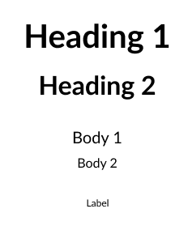

<div align="center">
  
  
  <br>

  <h1>Figma to Flutter MCP 服务器</h1>
  <h3>在你的编码代理中利用 Figma 的丰富数据。<br/>以 Flutter 的方式实现设计！</h3>
  <a href="https://npmcharts.com/compare/figma-flutter-mcp?interval=30">
    
  </a>
  <a href="https://github.com/mhmzdev/figma-flutter-mcp/blob/main/LICENSE">
    
  </a>
  <a href="https://twitter.com/mhmzdev">
    
  </a>
</div>
<br>

使用 [Cursor](https://cursor.sh) 或其他 AI 工具，通过 [MCP 服务器](https://modelcontextprotocol.io/) 访问 Figma 的文件、数据、组件等丰富内容。

## 📋 目录

- [🎥 视频演示](#-视频演示)
- [📝 入门](#-入门)
- [📚 工作原理](#-工作原理--详见此处)
- [🛠️ 用法](#-用法)
  - [🔑 Figma API 密钥](#-figma-api-密钥)
  - [🏹 Cursor 中的 MCP](#-cursor-中的-mcp)
  - [🚀 本地测试快速开始](#-本地测试快速开始)
- [🧱 基本工作流](#-基本工作流)
  - [🤖 AI 编码代理协助](#-ai-编码代理协助)
  - [⚠️ 为什么 SVG 资源在生成屏幕时不起作用](#-为什么-svg-资源在生成屏幕时不起作用)
- [🧰 MCP 工具](#-mcp-工具)
- [⚠️ 免责声明](#-免责声明)
- [🙌🏼 致谢](#-致谢)
- [🧱 其他框架](#-其他框架)
- [🔑 许可证](#-许可证)
- [🙋‍♂️ 作者](#-作者)
  - [Muhammad Hamza](#muhammad-hamza)


## 🎥 视频演示
使用真实的 Figma 设计展示了 Figma Flutter MCP 的几乎所有功能。
- 英文: https://youtu.be/lJlfOfpl2sI
- 乌尔都语/印地语: https://youtu.be/mepPWpIZ61M

## 📝 [入门](docs/getting-started.md)
你可以查看详细的 [getting started](docs/getting-started.md) 文档，或观看[演示视频](https://youtu.be/lJlfOfpl2sI) 作为快速开始。由于这是首次发布，还有大量改进空间；你也可以查看 [issues](https://github.com/mhmzdev/figma-flutter-mcp/issues) 了解还有哪些工作或可改进之处。

## 📚 工作原理 | [详见此处](docs/figma-flutter-mcp.md)
1. [组件/小部件](src/extractors/components/)
- ✅ 提取 Figma 节点数据：布局、样式、尺寸、颜色、文本内容等
- ✅ 分析结构：子元素、嵌套组件、视觉重要性
- ✅ 提供指导：建议 Flutter 小部件和实现模式
- ❌ 不会生成实际的 Flutter 代码文件

2. [屏幕](src/extractors/screens/)
- ✅ 提取屏幕元数据：设备类型、方向、尺寸
- ✅ 识别区块：页眉、页脚、导航、内容区域
- ✅ 分析导航：标签栏、应用栏、抽屉、导航元素
- ✅ 提供 Scaffold 指南：建议 Flutter 屏幕结构
- ❌ 不会生成实际的 Flutter 屏幕

本项目旨在帮助 AI 编写 Flutter 代码。因此，**更好的提示会带来更好的结果**。

## 🛠️ 用法
以下步骤展示最小化的使用与设置方式：

### 🔑 Figma API 密钥
你需要创建 Figma 访问令牌才能使用本服务器。如何创建 Figma API 访问令牌，请参考[这里](https://help.figma.com/hc/en-us/articles/8085703771159-Manage-personal-access-tokens)。

### 🏹 Cursor 中的 MCP
当你拥有 FIGMA API KEY 后，可在 Cursor 中按如下步骤设置 MCP：
1. 按 CMD + Shift + P（Windows 为 Ctrl）
2. 输入 "Open MCP Settings"
3. 点击 "Add new MCP"
4. 粘贴以下 JSON 对象

#### MacOS/Linux
```
{
  "mcpServers": {
    "Figma Flutter MCP": {
      "command": "npx",
      "args": ["-y", "figma-flutter-mcp", "--figma-api-key=YOUR-API-KEY", "--stdio"]
    }
  }
}
```
#### Windows
```
{
  "mcpServers": {
    "Figma Flutter MCP": {
      "command": "cmd",
      "args": ["/c", "npx", "-y", "figma-flutter-mcp", "--figma-api-key=YOUR-API-KEY", "--stdio"]
    }
  }
}
```

> 注意：如果你已将本 MCP 作为 `npm` 包安装，请确保保持为最新版本。有时旧版本会被缓存，导致持续出现“无法使用工具调用”或“Figma API 密钥设置无效”等错误。

### 🚀 本地测试快速开始
在本地开发时，请确保与你的本地服务器版本保持一致。有时 `npm i` 会为你全局安装该服务器，从而覆盖本地更改，导致你看不到更新。

#### 0. 先决条件
- Node.js 18+
- Figma API 密钥（访问令牌）
- 支持 MCP 的 Cursor AI IDE
- Flutter SDK

#### 1. 克隆仓库
```
# 克隆或下载项目
git clone <your-repo-url> figma-flutter-mcp
cd figma-flutter-mcp

# 安装依赖
npm install
```
#### 2. 配置
可以使用 `.env` 设置各类值。请查看 [.env.example](.env.example)
#### MacOS/Linux
```
{
  "mcpServers": {
    "figma-flutter-mcp": {
      "command": "node",
      "args": [
        "/Path/to/figma-flutter-mcp/dist/server.mjs",
        "--figma-api-key=YOUR_API_KEY",
        "--stdio"
      ]
    }
  }
}
```
#### Windows
```
{
  "mcpServers": {
    "figma-flutter-mcp": {
      "command": "node",
      "args": [
        "/Path/to/figma-flutter-mcp/dist/server.mjs",
        "--figma-api-key=YOUR_API_KEY",
        "--stdio"
      ]
    }
  }
}
```
> 注意：如果你只想在当前项目中使用以上 JSON，请将其配置在 `.cursor-mcp/config.json` 中。但请注意其中包含 API_KEY，务必将此文件加入 `.gitignore`。

#### 3. 构建与运行
```
# 开发模式（自动重启）
npm run dev

# 生产模式
npm run build
```
现在你可以在 MCP 设置中确认服务器是否正在运行以及工具是否可用。

## 🧱 基本工作流
### 🤖 AI 编码代理协助
为了获得更好的结果，你可以根据所用的 AI 编码代理，在以下文件中设置一些指令：
- Cursor: `.cursor/rules/fluttering.mdc`
- Claude: `CLAUDE.md`
- Gemini CLI: `GEMINI.md`

这样，AI 代理就能利用 MCP 的输出，确保 Flutter 代码符合你的项目要求和结构。你也可以查看用于测试的 [Cursor 规则示例](docs/cursor_rules_example.md)。

1. **设置主题与排版**：最有效的方式是在 Figma 中放置两个框架（帧），其中包含主题颜色和排版样例。例如：




- Figma 桌面端：选中框架后按 CMD + L
- Figma 网页端：选中框架后复制 URL

> 💡 提示：有效的 URL 会包含 FILE ID 和 NODE ID 参数。

```
"从 <figma_link> 设置 Flutter 主题，包括 Colors 和 Typography。"
```

2. **生成小部件**：最有效的方式是使用 Figma 的 COMPONENTS。例如：


该示例有 8 个变体，你可以在提示中指定是否需要使用变体。
```
"请基于 <figma_link> 在 Flutter 中创建此小部件；目前仅设置 2 个变体，并将文件拆分为较小部分以提升代码可读性。"
```
如果你在 Figma 中没有使用 COMPONENTS，也可以使用 FRAME，并在提示中说明希望将其作为小部件，工具会处理其余事项。

3. **生成完整屏幕**：如果存在图像资源（IMAGE ASSETS），将会导出到 `assets/` 并写入 `pubspec.yaml`。
```
"根据此 Figma 链接 <figma_link> 创建完整屏幕，并确保通过拆分文件使代码更易读。"
```
4. **导出资源**：
- 图像资源：在生成屏幕时会自动工作。
```
"从 Figma 导出此图像资源 <figma_link>"
```
- SVG 资源：不会自动工作，详见下文。
```
"从 Figma 将其导出为 SVG 资源：<figma_link>"
```
#### ⚠️ 为什么 SVG 资源在生成屏幕时不起作用
在 Figma 中矢量包括图标与钢笔工具绘制的形状，大批量导出时可能会抓取到非预期的节点；建议单独导出 SVG。该过程仍然能节省大量时间，因为会将它们保存到 `assets/svg/` 目录并更新 `pubspec.yaml`。

## 🧰 MCP 工具
与资源相关：
- `export_flutter_assets`：与屏幕生成配合使用的单个图像资源导出工具
- `export_svg_flutter_assets`：用于导出 SVG 资源的独立工具

与小部件相关：
- `analyze_figma_component`：用于 Figma 的 type=COMPONENT 或由用户指定的 FRAME
- `list_component_variants`：用于 Figma 的 type=COMPONENT_SET（小部件变体）
- `inspect_component_structure`：用于查看嵌套的 COMPONENTS 或 FRAMES

与屏幕相关：
- `analyze_full_screen`：type=FRAME 的完整屏幕分析与资源导出（仅图像）
- `inspect_screen_structure`：用于了解布局与实现屏幕所需信息

## ⚠️ 免责声明

- **Figma 设计**：我们使用 Figma API 获取节点及其详细信息；因此，如果你使用自动布局、优先使用帧而非分组、全局样式一致等，结果会更好。
- **使用场景**：当前阶段强烈建议不要用于开发可扩展的大型应用，而是用于 MVP、小型与说明性任务。
- **速率限制**：高强度使用可能触发 Figma 速率限制（如 HTTP 429）。服务器包含带退避的重试机制，但无法绕过 Figma 限制。如遇限制，请等待几分钟并降低请求频率。

## 🙌🏼 致谢
我受到 [Graham Lipsman](https://x.com/glipsman) 的 [Figma Context MCP](https://github.com/GLips/Figma-Context-MCP) 启发，因此开发了 Figma 到 Flutter 的专用 MCP，具备以下特性：
- 资源导出
- 颜色与主题设置
- 小部件树与完整屏幕构建

更多功能，敬请期待……

## 🧱 其他框架
如果你希望为 React、Angular、React Native、Vue 或其他框架开发此能力，我已提供详细文档 [Figma Framework MCP](docs/figma-framework-mcp.md) 供参考与上手。同时我会在此维护一个清单，记录各框架的 Figma MCP 服务器实现进度。
- ...
- ...

## 🔑 许可证
本项目基于 MIT 许可发布——详见 [LICENSE](LICENSE.md) 文件。

## 🙋‍♂️ 作者
#### Muhammad Hamza
[](https://www.linkedin.com/in/mhmzdev)

你也可以关注我的 GitHub 以获取项目更新：

[](https://github.com/mhmzdev)

如果你喜欢这个仓库，欢迎点亮一颗星 ⭐！

Copyright (c) 2025 MUHAMMAD HAMZA

---

为希望弥合设计与代码鸿沟的设计师与开发者倾情打造 ❤️。


