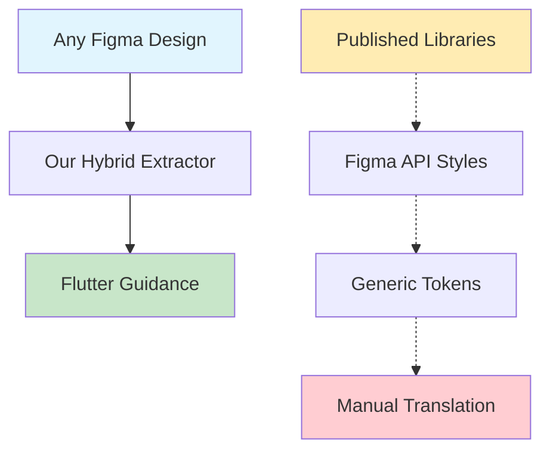

# Figma Flutter MCP: Why We Don't Rely Solely on Figma API
This is a detailed doc about why we didn't fork existing [Figma Context MCP](https://github.com/GLips/Figma-Context-MCP) or didn't rely on Figma's API alone.

## Overview

This project uses a **hybrid approach** that combines Figma API data extraction with intelligent analysis and Flutter-specific guidance generation. We deliberately avoid relying entirely on Figma's API endpoints for several critical reasons.

## The Problem with Pure Figma API Approach

### 1. **Published Resources Limitation**

Figma's API has significant limitations when it comes to accessing design resources:

```typescript
// ❌ Figma API only returns PUBLISHED resources
GET /v1/files/{file_key}/styles
// Returns: Only published color styles, text styles, effects

GET /v1/files/{file_key}/components  
// Returns: Only published components from libraries
```

**Reality Check:**
- Most internal design work is **NOT published**
- Designers often work with local styles and components
- Publishing requires additional workflow steps that many teams skip
- Internal/confidential projects cannot be published publicly

### 2. **Dev Mode Requirement**

Figma's Dev Resources endpoints provide richer data but come with restrictions:

```typescript
// ❌ Requires Dev Mode subscription
GET /v1/files/{file_key}/dev_resources
// Returns: Detailed component specs, but only with Dev Mode access
```

> NOTE: This is what [Figma Context MCP](https://github.com/GLips/Figma-Context-MCP) uses. That's an additional reason we need a different approach.

**Barriers:**
- **Dev Mode is a paid feature** - not available to all users
- **Freelancers and small teams** often don't have Dev Mode access
- **Client projects** may not provide Dev Mode access to external developers
- **Educational/personal projects** can't justify the cost

### 3. **Framework Agnostic vs Flutter Specific**

Figma's API returns generic design tokens and specifications:

```json
{
  "fills": [{"type": "SOLID", "color": {"r": 0.2, "g": 0.4, "b": 0.8}}],
  "effects": [{"type": "DROP_SHADOW", "radius": 4, "offset": {"x": 2, "y": 2}}]
}
```

This requires **additional translation** to Flutter-specific implementations:

```dart
// Manual translation needed:
Container(
  decoration: BoxDecoration(
    color: Color.fromRGBO(51, 102, 204, 1.0),
    boxShadow: [
      BoxShadow(
        offset: Offset(2, 2),
        blurRadius: 4,
        color: Colors.black26,
      )
    ],
  ),
)
```

## Our Hybrid Solution

### 1. **Direct Node Access**

We use Figma's basic node API to access **any design**, regardless of publication status:

```typescript
// ✅ Works with ANY Figma file (public or private)
GET /v1/files/{file_key}/nodes?ids={node_ids}
// Returns: Complete node structure with all properties
```

**Benefits:**
- Access to **unpublished designs**
- Works with **internal/confidential projects**
- No Dev Mode requirement
- Real design data, not just published libraries

### 2. **Intelligent Analysis Layer**

Instead of relying on Figma's interpretation, we analyze the raw node data:

```typescript
// Our intelligent analysis
function detectSemanticType(content: string, nodeName: string): SemanticType {
  // Detects: button, heading, body, link, error, success, etc.
  // Based on content analysis, not just Figma's classification
}

function generateFlutterTextWidget(textInfo: TextInfo): string {
  // Generates Flutter-specific widget suggestions
  // Considers semantic meaning, not just visual properties
}
```

**Advantages:**
- **Semantic understanding** of design intent
- **Flutter-optimized** suggestions
- **Context-aware** recommendations
- **Handles edge cases** that Figma API misses

### 3. **Flutter-First Approach**

Our output is specifically tailored for Flutter development:

```typescript
// ✅ Flutter-specific guidance
guidance += `Container(\n`;
guidance += `  decoration: BoxDecoration(\n`;
guidance += `    color: Color(0xFF${fill.hex.substring(1)}),\n`;
guidance += `    borderRadius: BorderRadius.circular(${cornerRadius}),\n`;
guidance += `  ),\n`;
```

**vs Generic Figma API:**
```json
{
  "cornerRadius": 8,
  "fills": [{"color": {"r": 0.2, "g": 0.4, "b": 0.8}}]
}
```

## Architecture Benefits

### 1. **Universal Accessibility**



**Our Approach:**
- ✅ Works with **any Figma file**
- ✅ No publishing requirements
- ✅ No Dev Mode needed
- ✅ Direct Flutter output

**Pure API Approach:**
- ❌ Only published resources
- ❌ Requires Dev Mode for detailed specs
- ❌ Generic, framework-agnostic output
- ❌ Additional translation layer needed

### 2. **Real-World Compatibility**

| Scenario | Pure Figma API | Our Hybrid Approach |
|----------|----------------|---------------------|
| **Internal Company Designs** | ❌ Not published | ✅ Full access |
| **Freelancer Projects** | ❌ No Dev Mode | ✅ Works perfectly |
| **Client Confidential Work** | ❌ Cannot publish | ✅ Private access |
| **Personal/Learning Projects** | ❌ Cost prohibitive | ✅ Free to use |
| **Rapid Prototyping** | ❌ Requires setup | ✅ Instant analysis |

### 3. **Flutter Optimization**

```typescript
// Our approach generates Flutter-ready code
if (textInfo.semanticType === 'button') {
  return `ElevatedButton(
    onPressed: () {
      // TODO: Implement ${textInfo.content} action
    },
    child: Text('${textInfo.content}'),
  )`;
}

// vs Figma API generic response
{
  "type": "TEXT",
  "characters": "Click Me",
  "fills": [...]
}
```

## Data Flow Architecture

### 1. **Extraction Phase**
```typescript
// Direct node access - works with any design
const node = await figmaService.getNode(fileId, nodeId);

// Extract comprehensive data
const analysis = {
  metadata: extractMetadata(node),
  layout: extractLayoutInfo(node),
  styling: extractStylingInfo(node),
  text: extractTextInfo(node),
  children: analyzeChildren(node)
};
```

### 2. **Analysis Phase**
```typescript
// Intelligent semantic analysis
const semanticType = detectSemanticType(text.content, node.name);
const deviceType = detectDeviceType(dimensions);
const sectionType = detectSectionType(node);

// Flutter-specific optimizations
const flutterGuidance = generateFlutterGuidance(analysis);
```

### 3. **AI Consumption Phase**
```typescript
// Structured output for AI consumption
return {
  designData: analysis,
  flutterGuidance: guidance,
  assetInfo: exportedAssets,
  implementationSuggestions: suggestions
};
```

## What We DON'T Do vs What We DO

### ❌ **What We DON'T Do:**
- **Create `.dart` files** - We don't generate actual Flutter code files
- **Generate complete Flutter projects** - No project scaffolding or structure creation
- **Write executable Flutter applications** - No runnable app generation
- **Manage Flutter project structure** - No file organization or dependency management

### ✅ **What We DO:**
- **Extract design data from Figma** - Comprehensive analysis of layouts, styling, and content
- **Generate text-based guidance with Flutter syntax** - Structured recommendations for AI consumption
- **Provide copy-paste ready snippets** - Ready-to-use Flutter widget patterns with real design values
- **Structure information for AI consumption** - Organized data that AI models can use to generate actual code
- **Export and manage assets** - Automatic image export with Flutter integration

### 🎯 **The AI Workflow:**
1. **Our Tool**: Figma Design → Structured Analysis + Flutter Guidance Text
2. **AI Model**: Reads Guidance → Generates Actual Flutter Code Files
3. **Developer**: Gets Complete Flutter Widgets/Screens

## Why This Matters

### For Developers
- **No barriers** to entry - works with any Figma file
- **Flutter-optimized** guidance reduces development time
- **Semantic understanding** provides better widget suggestions
- **Asset management** handles images automatically
- **Better prompts = Better results** - The more detailed your design analysis request, the more precise and useful the Flutter guidance will be

### For Designers
- **No publishing required** - analyze any design
- **Works with internal files** - no need to make designs public
- **Preserves design intent** through semantic analysis
- **Handles real-world design patterns**

### For Teams
- **Cost-effective** - no Dev Mode subscription needed
- **Flexible** - works with any Figma access level
- **Secure** - handles confidential designs
- **Efficient** - structured guidance for AI code generation

## Important Notes

### 🚧 **Early Release Disclaimer**
This project is in **early release** stage. While we strive for accuracy and reliability:

- **Bugs are expected** - Please report issues you encounter
- **Active development** - Features and APIs may change
- **Community feedback welcome** - Your input helps improve the tool
- **Production use** - Test thoroughly before using in critical projects

### 💡 **Optimization Tips**
- **Better prompts = Better results** - Be specific about what you want to analyze
- **Detailed requests** - "Analyze this login form component" vs "Analyze this"
- **Context matters** - Mention the component type, expected behavior, or specific concerns
- **Iterative refinement** - Use inspection tools first, then detailed analysis

### 📝 **Example of Good vs Poor Prompts**

**❌ Poor Prompt:**
```
Analyze this Figma link: https://figma.com/...
```

**✅ Good Prompt:**
```
Analyze this login form component from Figma: https://figma.com/...
Focus on the input field styling, button states, and form validation patterns.
I need Flutter widgets for a mobile app with Material Design.
```

## Conclusion

Our hybrid approach solves real-world problems that pure Figma API solutions cannot address:

1. **Accessibility**: Works with any Figma file, regardless of publication status
2. **Cost-effectiveness**: No premium subscriptions required
3. **Flutter-first**: Optimized specifically for Flutter development
4. **Intelligence**: Semantic analysis beyond basic API data
5. **Practicality**: Handles real-world design workflows
6. **AI-Ready**: Structured guidance for intelligent code generation

This architecture ensures that **any developer** can convert **any Figma design** into **Flutter-ready guidance**, regardless of their Figma subscription level or the design's publication status.

The result is a tool that works in the real world, not just in ideal conditions with premium subscriptions and published design systems. As an early release, we're committed to continuous improvement based on community feedback and real-world usage patterns.
