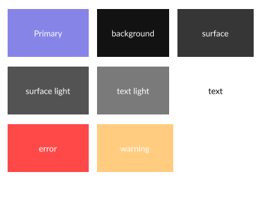

# Getting Started with Figma Flutter MCP

Welcome to Figma Flutter MCP! This guide will walk you through setting up and using the MCP server to convert Figma designs into Flutter code using AI-powered tools like Cursor.

## 🚀 Quick Setup in Cursor

### 1. Get Your Figma API Key

First, you'll need a Figma access token:

1. Go to [Figma Account Settings](https://www.figma.com/settings)
2. Scroll down to "Personal access tokens"
3. Click "Create new token"
4. Give it a name (e.g., "Flutter MCP")
5. Copy the token (keep it secure!)

> 📋 **Note**: You only need a free Figma account - no Dev Mode subscription required!

### 2. Configure MCP in Cursor

1. Open Cursor
2. Press `Cmd + Shift + P` (or `Ctrl + Shift + P` on Windows)
3. Type "Open MCP Settings" and select it
4. Click "Add new MCP"
5. Paste the configuration below:

#### For macOS/Linux:
```json
{
  "mcpServers": {
    "Figma Flutter MCP": {
      "command": "npx",
      "args": ["-y", "figma-flutter-mcp", "--figma-api-key=YOUR-API-KEY-HERE", "--stdio"]
    }
  }
}
```

#### For Windows:
```json
{
  "mcpServers": {
    "Figma Flutter MCP": {
      "command": "cmd",
      "args": ["/c", "npx", "-y", "figma-flutter-mcp", "--figma-api-key=YOUR-API-KEY-HERE", "--stdio"]
    }
  }
}
```

**Important**: Replace `YOUR-API-KEY-HERE` with your actual Figma API key.

### 3. Verify Setup

1. Restart Cursor
2. Open a new chat
3. You should see "Figma Flutter MCP" in the available tools
4. Test with: "Can you help me convert Figma designs to Flutter?"

---

## 🎨 Setting Up Theme Colors

The most efficient way to generate Flutter themes is to create a dedicated theme frame in Figma.

### Create Your Theme Frame

1. **In Figma**: Create a frame with your color palette
2. **Organize colors** by purpose (primary, secondary, background, etc.)
3. **Add labels** to identify each color's purpose



### Get the Figma Link

**Figma Desktop**: 
- Select your theme frame
- Press `Cmd + L` (or `Ctrl + L`)

**Figma Web**: 
- Select your theme frame  
- Copy the URL from your browser

### Generate Flutter Theme

Use this prompt in Cursor:

```
Setup Flutter theme from <figma_link> including all colors. 
Create a comprehensive ColorScheme and ThemeData that follows Material Design 3 principles.
Organize the colors by their semantic meaning (primary, secondary, surface, etc.).
```

**Example Result**: You'll get a complete Flutter theme with:
- `ColorScheme` with proper semantic color assignments
- `ThemeData` configuration
- Custom color extensions if needed
- Usage examples for each color

---

## ✍️ Setting Up Typography

Create a typography system that matches your design language.

### Create Your Typography Frame

1. **In Figma**: Create a frame with text samples
2. **Include different styles**: Headlines, body text, captions, etc.
3. **Show hierarchy**: H1, H2, H3, body, small text
4. **Add style names** for clarity


### Get the Figma Link

Same process as theme colors - select the frame and copy the link.

### Generate Flutter Typography

Use this prompt in Cursor:

```
Setup Flutter typography theme from <figma_link>. 
Create a complete TextTheme with all the text styles shown.
Include font weights, sizes, and letter spacing that match the design.
Provide usage examples for each text style.
```

**Example Result**: You'll get:
- Complete `TextTheme` configuration
- Proper Material Design text style assignments
- Custom text styles if your design uses unique typography
- Code examples showing how to use each style

---

## 🧩 Single Widget Creation

Convert individual Figma components into reusable Flutter widgets.

### Best Practices for Widget Design

1. **Use Figma Components** when possible (creates variants automatically)
2. **Name your components** descriptively 
3. **Create variants** for different states (enabled/disabled, light/dark)
4. **Include all interactive states**


### Get the Component Link

**For Components**:
- Select the component or component set
- Copy the link (`Cmd + L` or `Ctrl + L`)

**For Frames** (if you don't have components):
- Select any frame you want to convert to a widget
- Copy the link

### Generate Flutter Widget

Use this prompt in Cursor:

```
Create this widget in Flutter from <figma_link>. 
Include 2-3 main variants and break the code into smaller, readable files.
Make it a reusable component with proper state management.
Include documentation and usage examples.
```

**Example Result**: You'll get:
- Main widget file with clean, readable code
- Separate files for complex sub-components
- Proper state management (StatefulWidget if needed)
- Variant handling (different styles/states)
- Documentation and usage examples
- Proper Flutter best practices

### Advanced Widget Prompts

**For Complex Components**:
```
Analyze this complex component from <figma_link>. 
Break it down into smaller sub-widgets for better maintainability.
Include proper state management and animation support where appropriate.
```

**For Component Sets with Many Variants**:
```
Create this component set from <figma_link> with all variants.
Use enums for variant selection and ensure type safety.
Optimize for performance and reusability.
```

---

## 📱 Full Screen Generation

Convert entire Figma screens into complete Flutter screens with proper structure.

### Prepare Your Screen Design

1. **Use Frames** for full screens
2. **Include navigation elements** (app bars, bottom navigation)
3. **Add realistic content** (not just placeholder text)
4. **Consider responsive design** for different screen sizes

### Get the Screen Link

- Select the main screen frame
- Copy the Figma link

### Generate Flutter Screen

Use this prompt in Cursor:

```
Create a complete Flutter screen from this Figma design: <figma_link>
Ensure the code is well-organized with smaller, readable files.
Include proper navigation structure and responsive design.
Export any image assets automatically.
```

**Example Result**: You'll get:
- Main screen file with `Scaffold` structure
- Separate widget files for complex sections
- Proper navigation setup (AppBar, BottomNavigationBar, etc.)
- Responsive design considerations
- Automatic image asset export to `assets/` folder
- Updated `pubspec.yaml` with asset references
- Clean, maintainable code structure

### Advanced Screen Prompts

**For Complex Layouts**:
```
Analyze this complex screen layout from <figma_link>.
Create a responsive design that works on both mobile and tablet.
Use proper Flutter layout widgets and ensure good performance.
```

**For Screens with Navigation**:
```
Create this screen from <figma_link> with proper navigation integration.
Include route definitions and navigation logic.
Ensure it fits well within a larger app structure.
```

**For Data-Driven Screens**:
```
Convert this screen from <figma_link> into a Flutter screen.
Make it data-driven with proper model classes and state management.
Include loading states and error handling.
```

---

## 💡 Pro Tips for Better Results

### 1. **Be Specific in Your Prompts**

❌ **Vague**: "Convert this Figma design"
✅ **Specific**: "Create a reusable login form widget from this Figma component with validation states"

### 2. **Mention Your Requirements**

- Target platform (mobile, web, desktop)
- State management preference (Provider, Riverpod, Bloc)
- Design system (Material 3, Cupertino, custom)
- Performance considerations

### 3. **Iterative Refinement**

Start with basic conversion, then refine:
```
1. "Convert this basic button from <figma_link>"
2. "Add animation and haptic feedback to the button"
3. "Make it accessible with proper semantics"
```

### 4. **Asset Management**

- **Images**: Automatically exported with screen generation
- **SVGs**: Export separately using: `"Export this as SVG asset from <figma_link>"`
- **Icons**: Consider using Flutter's built-in icons or icon fonts

### 5. **Code Organization**

Always request:
- Separate files for complex components
- Proper folder structure
- Clear naming conventions
- Documentation and comments

---

## 🔧 Troubleshooting

### Common Issues

**"MCP Server Not Found"**
- Restart Cursor after adding MCP configuration
- Check that your API key is correct
- Ensure you have internet connection for `npx` to download the package

**"Figma API Error"**
- Verify your API key is valid
- Check that the Figma file is accessible with your account
- Ensure the Figma link contains both file ID and node ID

**"Rate Limiting"**
- Wait a few minutes between large requests
- Analyze one component/screen at a time
- Avoid rapid-fire requests

### Getting Help

1. **Check the [Issues](https://github.com/mhmzdev/figma-flutter-mcp/issues)** on GitHub
2. **Read the detailed [documentation](figma-flutter-mcp.md)**
3. **Join the community** discussions
4. **Report bugs** with specific examples

---

## 🎯 Next Steps

Now that you're set up, try these workflows:

1. **Start with Theme**: Set up your app's color scheme and typography
2. **Create Components**: Build a library of reusable widgets
3. **Build Screens**: Convert full designs into complete Flutter screens
4. **Iterate and Refine**: Use AI to improve and optimize your code

Remember: The better your Figma designs are organized and the more specific your prompts are, the better results you'll get!

---

**Happy coding! 🚀**

*Built with ❤️ for designers and developers who want to bridge the gap between design and code.*
